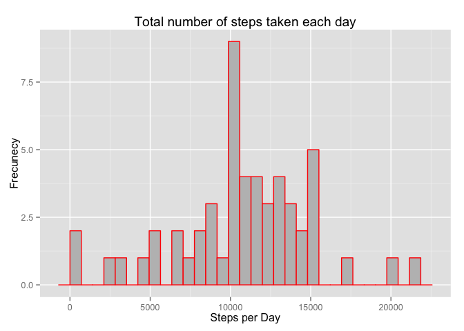
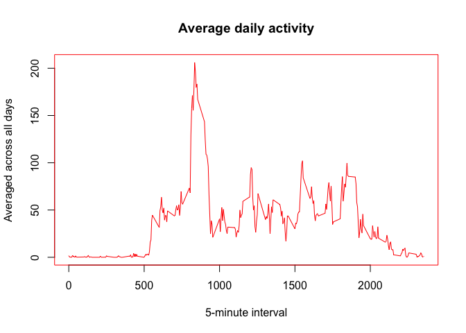
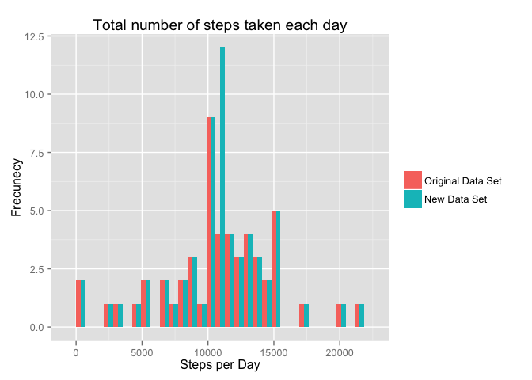
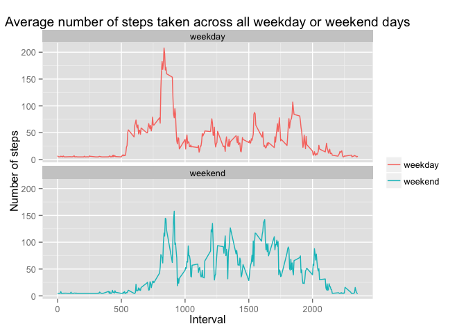

# Reproducible Research: Peer Assessment 1


## Loading and preprocessing the data

1. Load the data


```r
data <- read.csv("activity.csv") # read the csv file
```

2. Process/transform the data (if necessary) into a format suitable for your analysis


```r
data$date <- as.Date(data$date)
```

Preview the data

```r
str(data) # inspect variables
```

```
## 'data.frame':	17568 obs. of  3 variables:
##  $ steps   : int  NA NA NA NA NA NA NA NA NA NA ...
##  $ date    : Date, format: "2012-10-01" "2012-10-01" ...
##  $ interval: int  0 5 10 15 20 25 30 35 40 45 ...
```

```r
head(data)
```

```
##   steps       date interval
## 1    NA 2012-10-01        0
## 2    NA 2012-10-01        5
## 3    NA 2012-10-01       10
## 4    NA 2012-10-01       15
## 5    NA 2012-10-01       20
## 6    NA 2012-10-01       25
```

```r
summary(data)
```

```
##      steps             date               interval     
##  Min.   :  0.00   Min.   :2012-10-01   Min.   :   0.0  
##  1st Qu.:  0.00   1st Qu.:2012-10-16   1st Qu.: 588.8  
##  Median :  0.00   Median :2012-10-31   Median :1177.5  
##  Mean   : 37.38   Mean   :2012-10-31   Mean   :1177.5  
##  3rd Qu.: 12.00   3rd Qu.:2012-11-15   3rd Qu.:1766.2  
##  Max.   :806.00   Max.   :2012-11-30   Max.   :2355.0  
##  NA's   :2304
```


## What is mean total number of steps taken per day?

1. Calculate the total number of steps taken per day


```r
stepsPerDay <- aggregate(steps ~ date, data=data, FUN=sum)
```

2. Make a histogram of the total number of steps taken each day


```r
library(ggplot2)
ggplot(stepsPerDay , aes(x=steps)) +
geom_histogram( colour="red", fill="gray") +
labs(x="Steps per Day", y="Frecunecy") + 
labs(title="Total number of steps taken each day")
```

 

3. Calculate and report the mean and median of the total number of steps taken per day 

```r
mean(stepsPerDay$steps)
```

```
## [1] 10766.19
```

```r
median(stepsPerDay$steps)
```

```
## [1] 10765
```

## What is the average daily activity pattern?
1. Make a time series plot (i.e. type = "l") of the 5-minute interval (x-axis) and the average number of steps taken, averaged across all days (y-axis)


```r
interSteps <- aggregate(steps ~ interval, data = data, FUN = mean)
par(col="red")
plot(interSteps, type = "l", xlab="5-minute interval", ylab="Averaged across all days")
title("Average daily activity")
```

 

2. Which 5-minute interval, on average across all the days in the dataset, contains the maximum number of steps?


```r
interSteps$interval[which.max(interSteps$steps)]
```

```
## [1] 835
```


## Imputing missing values

1. Calculate and report the total number of missing values in the dataset (i.e. the total number of rows with NAs)


```r
nrow(data[is.na(data$steps),])
```

```
## [1] 2304
```

2. Devise a strategy for filling in all of the missing values in the dataset. The strategy does not need to be sophisticated. For example, you could use the mean/median for that day, or the mean for that 5-minute interval, etc.

Replace the NA values for the mean

```r
newSteps <- mean(na.omit(data$steps)) 
print(newSteps)
```

```
## [1] 37.3826
```

3. Create a new dataset that is equal to the original dataset but with the missing data filled in.


```r
 newData <- data
 newData$steps[is.na(newData$steps)] <- newSteps
```

4. Make a histogram of the total number of steps taken each day and Calculate and report the mean and median total number of steps taken per day. Do these values differ from the estimates from the first part of the assignment? What is the impact of imputing missing data on the estimates of the total daily number of steps?


```r
newStepsPerDay <- aggregate(steps ~ date, data=newData, FUN=sum)
stepsPerDay$cond <- c("A") # adding a column to diferentiate the data sets
newStepsPerDay$cond <- c("B")
total <- rbind(stepsPerDay,newStepsPerDay) #merge the data set for the histogram

ggplot(total, aes(x=steps, fill=cond)) +
geom_histogram(position="dodge")+
theme(legend.title=element_blank())+
scale_fill_discrete(name="",
                    breaks=c("A", "B"),
                    labels=c("Original Data Set", "New Data Set"))+
labs(x="Steps per Day", y="Frecunecy") + 
labs(title="Total number of steps taken each day")
```

 

```r
mean(newStepsPerDay$steps)
```

```
## [1] 10766.19
```

```r
median(newStepsPerDay$steps)
```

```
## [1] 10766.19
```

There isn't a big difference between original and new data set

## Are there differences in activity patterns between weekdays and weekends?
1. Create a new factor variable in the dataset with two levels – “weekday” and “weekend” indicating whether a given date is a weekday or weekend day.


```r
 newData$day <- weekdays(as.Date(newData$date)) #add new column using weekdays function
 for (i in 1:nrow(newData)){
  if (newData$day[i] == "Saturday" || newData$day[i] == "Sunday"){
    newData$wow[i] <- "weekend"
  }
  else{
    newData$wow[i] <- "weekday"
  }
 } 
newData$wow <- as.factor(newData$wow)
```

2. Make a panel plot containing a time series plot (i.e. type = “l”) of the 5-minute interval (x-axis) and the average number of steps taken, averaged across all weekday days or weekend days (y-axis). 


```r
stepsInterval <- aggregate(steps ~ interval+wow,newData , mean)
qplot(interval, steps, data=stepsInterval, geom=c("line"), xlab="Interval", colour=wow,
      ylab="Number of steps", main="Average number of steps taken across all weekday or weekend days") + facet_wrap(~ wow, ncol=1) + theme(legend.title=element_blank())
```

 

